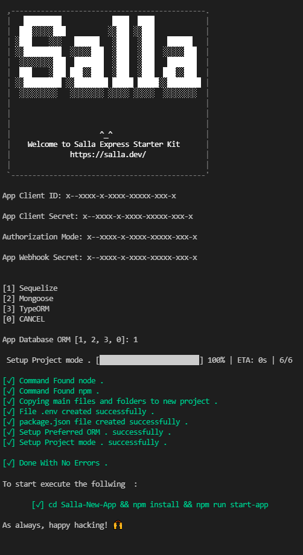
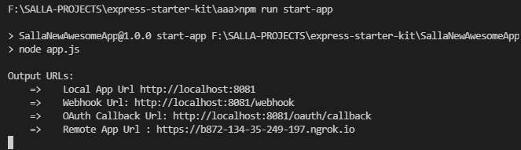
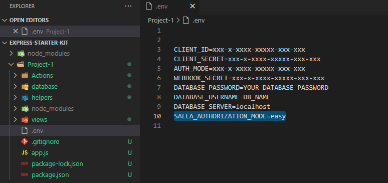

<div id="top"></div>

<br />
<div align="center"> 
  <a href="https://salla.dev"> 
     
  </a>
  <h1 align="center">Salla Apps Starter Kit</h1>
  <p align="center">
    An awesome starter template to create your Salla Apps today!
    <br />
    <a href="https://salla.dev/"><strong>Explore our blogs »</strong></a>
    <br />
    <br />
    <a href="https://github.com/SallaApp/Laravel-Start-Kit/issues/new">Report Bug</a> · 
    <a href="https://github.com/SallaApp/Laravel-Start-Kit/discussions/new">Request Feature</a> . <a href="https://t.me/salladev">&lt;/Salla Developers&gt;</a>
  </p>
</div>

<!-- TABLE OF CONTENTS -->
<details open>
  <summary>Table of Contents</summary>
  <ol>
    <li>
      <a href="#overview">Overview</a>
    </li>
    <li>
      <a href="#getting-started">Getting Started</a>
      <ul>
        <li><a href="#prerequisites">Prerequisites</a></li>
        <li><a href="#installation">Installation</a></li>
      </ul>
    </li>
    <li><a href="#usage">Usage</a></li>
    <li>
        <a href="#configure-authorization-modes-">Configure Authorization Modes</a>
        <ul>
            <li><a href="#easy-mode-">Easy Mode</a></li>
            <li><a href="#custom-mode-">Custom Mode</a></li>
        </ul>
    </li>
    <li>
        <a href="#authorization-service">Authorization Service</a>
        <ul>
            <li><a href="#refreshing-a-token">Refreshing a Token</a></li>
        </ul>
    </li>
    <li>
        <a href="#webhooks">Webhooks</a>
        <ul>
            <li><a href="#order-related-webhooksactions">Order Related Webhooks/Actions</a></li>
            <li><a href="#products-related-webhooksactions">Products Related Webhooks/Actions</a></li>
            <li><a href="#customer-related-webhooksactions">Customer Related Webhooks/Actions</a></li>
            <li><a href="#category-related-webhooksactions">Category Related Webhooks/Actions</a></li>
            <li><a href="#brand-related-webhooksactions">Brand Related Webhooks/Actions</a></li>
            <li><a href="#store-related-webhooksactions">Store Related Webhooks/Actions</a></li>
            <li><a href="#coupon-related-webhooksactions">Coupon Related Webhooks/Actions</a></li>
      </ul>
    </li>
    <li>
        <a href="#commands">Commands</a>
        <ul>
            <li><a href="#setup-command">Setup command</a></li>
            <li><a href="#create-new-webhookaction-command">Create new Webhook/Action command</a></li>
      </ul>
    </li>
    <li><a href="#contributing">Contributing</a></li>
    <li><a href="#license">License</a></li>
  </ol>
</details>

<!-- Overview -->

## Overview

This is a starter App to create ExpressJS application equipped with the required auth processes and webhooks/actions that help you to create your Salla App which works with the [Salla APIs](https://docs.salla.dev/). Your App later can be published to the [Salla App Store](https://apps.salla.sa/) and be available for installation to any of Salla [Merchants Stores](https://s.salla.sa/).

What can you use this starter App for?

- Create a Salla App from scratch, e.g. chatbot app or shipping service app, or any amazing app from your idea.
- Modify/Customize any of your previous Apps in order to take the advantages given by this starter App.
<p align="right">(<a href="#top">back to top</a>)</p>

<!-- GETTING STARTED -->

## Getting Started

The starter App comes with an easy _1-command step_ that does the complete setup for your starter App. To be ready, you will need some prerequisites which will be listed hereafter.

### Prerequisites

- Create a Partner account at [Salla Partner Portal](https://salla.partners/)
- Create your App in [Salla Partner Portal](https://salla.dev/blog/create-your-first-app-on-salla-developer-portal/)

  > From your App dashboard at [Salla Partner Portal](https://salla.partners/), you will be able to get your App's _Client ID, Client Secret Key and Webhook Secret Key_ which you will use later duraing the setup process.

- For EpxressJS compatibility : ` NodeJS >= 12.x.x, Node Package Manager and it support any Database [MySQL,MongoDB,PostgreSQL]`

That is all!

### Installation

The installation process is straightforward as you will see in the below steps.

1. Install project creator using npm .

```sh
npm install @salla.sa/express-starter-kit
```

2. In your command line: **run** the following `create-project` npm command to create your Express starter App project.

```sh
npm run create-project {your-awesome-app}
```

The above `create-project` will take you through a step-by-step process in which you'll enter your App's _Client ID, Client Secret Key, and Webhook Secret Key_, which you can get from your App dashboard in the Partners Panel, as well as your database name, which is set to `my_app_db` by default.

> The step will ask you to select the authorization mode for your App, which can be [Easy or Custom mode.](#auth-modes)
> In case you selected the _Custom_ mode for your App authorization, you will need to enter the **same callback Url you already entered in your App dashboard at the [Salla Partner Portal](https://salla.partners/)**



<p align="right">(<a href="#top">back to top</a>)</p>

## Usage

1. In your command line: **Run** `npm run start-app` command



Now you can open your browser to view your App at `Remote App Url` in the [output URLs.](#output-urls). 🎉

2. Login to the Laravel App with the demo account: Email: `awesome@salla.dev`, Password: `in ksa`
3. Click the button to request the _Access Token_.
4. The Laravel App will redirect you to Merchant Auth Page.
5. Login using a Merchant Account (or the demo store of your app).
6. Give access to your App.

> If you are using [Easy mode.](#auth-modes.easy) the access token will push to the action ([`app.store.authorize`](app\template\Actions\app\store.authorize.js)) via webhook
>
> If you are using [Custom mode.](#auth-modes.custom) the browser will redirect you again to the [`store.authorize.js file`](app\template\Actions\app\store.authorize.js).

#### Output URLs <span id='output-urls'>

| URL                | Description                                                                                                              |
| ------------------ | ------------------------------------------------------------------------------------------------------------------------ |
| Local App Url      | The local link for your App\.                                                                                            |
| Remote App Url     | The online link to your App\. It will be always synced with the local Url                                                |
| Webhook Url        | The Url link that connects your App with any action that may happen at the Merchant store, e\.g\. \ncreate new product\. |
| OAuth Callback Url | The App entry page where the access token is generated; Note that this Url is available only for the `Custom` mode auth. |

<p align="right">(<a href="#top">back to top</a>)</p>

## Configure Authorization Modes <span id='auth-modes'>

While creating your App in the [Salla Partners Portal](https://salla.partners/), you will see that Salla provids two methods for the OAuth protocol, which are the `Easy Mode` and the `Custom Mode`.

> During the setup process, the default _OAuth protocol_ will be set to the `Easy Mode`, which can be configured from the file [`.env`](.env).
> All of the setup's values/keys are stored in the `.env` file as we can see in the below image.



#### Easy Mode <span id='auth-modes.easy'>

This mode is the default mode for the authorization, which means that the `access token` is generated automatically at Salla's side back to you.
You may refer to the class [`StoreAuthorize`](app\template\Actions\app\store.authorize.js) which is defined inside [`app\template\Actions\app\store.authorize.js`](app\template\Actions\app\store.authorize.js) to get more details on how to receive and manage the `access token`

#### Custom Mode <span id='auth-modes.custom'>

A callback Url is the Url that is triggered when the App has been granted authorization. This should be a valid Url to which the merchant's browser is redirected. In this mode, you will need to set a custom callback url from the App dashboard at the [Salla Partner Portal](https://salla.partners/). This callback url will redirect the merchants who are interested in using your app into your App entry page where the access token is generated.

> The custom url will redirect the merchant to the [Store Dashboard](https://s.salla.sa/apps) in order to access the Store where he needs your App to be installed.

<br />
    
## Authorization Service
    
This project comes with a simple singleton authorization service to help you with managing the access and refresh tokens

```javascript
const express = require("express");
const passport = require("passport");
const SallaAPIFactory = require("@salla.sa/passport-strategy");
const app = express();

const port = 8081;

// we initialize our Salla API
const SallaAPI = new SallaAPIFactory({
  clientID: "CLIENT_ID", // The client ID assigned to you by Salla in Salla Partner Portal
  clientSecret: "CLIENT_SECRET", // The client password assigned to you by Salla in Salla Partner Portal
  callbackURL: "http://localhost:8081/oauth/callback", // the /oauth/callback in your service
});

// Use the Salla Strategy within Passport.
passport.use(SallaAPI.getPassportStrategy());

// save token and user data to your selected database
SallaAPI.onAuth((accessToken, refreshToken, expiresin, user) => {
  /*
accessToken
refreshToken
expires*in
user
\*/
});

//when your user login to your application you can retrieve the access token and use
//it to access the Salla APIs from SallaAPI.setAccessToken .

SallaAPI.setAccessToken(
  ACCESS_TOKEN_FROM_DATABASE,
  REFRESH_TOKEN_FROM_DATABASE,
  EXPIRES_IN_FROM_DATABASE,
  USER_PROFILE_FROM_DATABASE
);

// we set salla express middleware
app.use((req, res, next) => SallaAPI.setExpressVerify(req, res, next));

// GET /
// render the index page

app.get("/", function (req, res) {
  res.send({ user: req.user });
});

// GET /oauth/redirect
// Use passport.authenticate() as route middleware to authenticate the
// request. The first step in salla authentication will involve redirecting
// the user to accounts.salla.sa. After authorization, salla will redirect the user
// back to this application at /oauth/callback
app.get("/oauth/redirect", passport.authenticate("salla"));

// GET /oauth/callback
// Use passport.authenticate() as route middleware to authenticate the
// request. If authentication fails, the user will be redirected back to the
// login page. Otherwise, the primary route function function will be called,
// which, in this example, will redirect the user to the home page.
app.get(
  "/oauth/callback",
  passport.authenticate("salla", { failureRedirect: "/login" }),
  function (req, res) {
    res.redirect("/");
  }
);

app.listen(port, function () {
  console.log("App is listening on port " + port);
});
```

### Refreshing a Token

Access tokens expire after one week. Once expired, you will have to refresh a user’s access token. you can easily request a new access token via the current refresh token for any user like this

```javascript
const SallaAPI = require("@salla.sa/passport-strategy");

SallaAPI.requestNewAccessToken(SallaAPI.getRefreshToken())
  .then(({ accessToken, newRefreshToken }) => {
    // save new access token and refresh token to your database
  })
  .catch((err) => res.send(err));
```

<br />
    
<!-- Webhooks -->
## Webhooks
[Webhooks](https://docs.salla.dev/docs/merchant/ZG9jOjI0NTE3NDg1-webhook) simplify the communication between your App and [Salla APIs](https://docs.salla.dev/). In this way, you will be notified whenever your app receives payload/data from the Salla APIs. These webhooks are triggered along with many actions such as an order or product being created, a customer logs in, a coupon is applied, and much more.

Salla already defined a list of the webhooks/actions that are triggered automatically. The predefined webhooks/actions can be found in the folder [`app/Actions`](https://github.com/SallaApp/express-starter-kit/tree/master/template/Actions).

<!-- COMMANDS -->

## Commands

### Setup command

The setup file can be found in [`src`](https://github.com/SallaApp/express-starter-kit/tree/master/src/setup.js).

```sh
npm run create-app YOUR_APP_NAME
```

### Create new Webhook/Action command

The predefined [Webhooks](#webhooks), events/actions, can be found in folder [`app/Actions`](https://github.com/SallaApp/express-starter-kit/tree/master/src/template/Actions).

> You may define your own new webhook/action the way fits your App's requirments.

```sh
npm run create-webhook YOUR_APP_NAME {event-name}
```

<br />
    
<!-- CONTRIBUTING -->
## Contributing

Contributions are what make the open-source community such an amazing place to learn, inspire, and create.
Any contributions you make are **greatly appreciated**.

If you have a suggestion that would make this better, please fork the repo and create a pull request.
You can also simply open an issue with the tag "enhancement". Don't forget to give the project a star! Thanks again!

1. Fork the Project
2. Create your Feature Branch (`git checkout -b feature/AmazingFeature`)
3. Commit your Changes (`git commit -m 'Add some AmazingFeature'`)
4. Push to the Branch (`git push origin feature/AmazingFeature`)
5. Open a Pull Request

<p align="right">(<a href="#top">back to top</a>)</p>

## Security

If you discover any security-related issues, please email security@salla.sa instead of using the issue tracker.

## Credits

- [Salla](https://github.com/sallaApp)
- [All Contributors](../../contributors)

## License

The MIT License (MIT). Please see [License File](LICENSE.md) for more information.

<p align="right">(<a href="#top">back to top</a>)</p>
